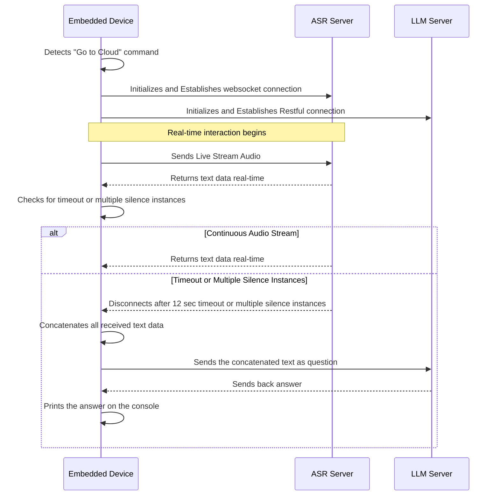

# OpenAI SDK
- https://platform.openai.com/docs/api-reference/introduction

# Deepgram SDK
- https://github.com/deepgram/deepgram-python-sdk
- https://developers.deepgram.com/docs/python-sdk-streaming-transcription
# API key:

